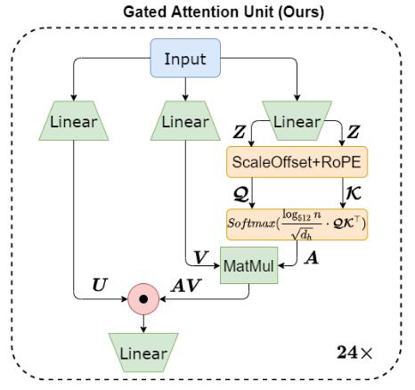

# Supplementary Material: Implementation and Experiments for GAU-based Model

论文地址：

- [https://arxiv.org/abs/2205.05842](https://arxiv.org/abs/2205.05842)

## 整体思路以及计算方式

一篇对苏神提出方法的总结，利用2层GAU代替Transformer：

计算方式如下：

- 给定输入：$$\mathbf X\in \mathbb R^{n\times d}$$
- 线性变换：$$\mathbf Z=\mathbf X\mathbf W_Z\in \mathbb R^{n\times d_1},\mathbf  U=\mathbf X\mathbf  W_U \in \mathbb R^{n\times d_1},\mathbf  V=\mathbf X\mathbf W_V \in \mathbb R^{n\times d_2}$$
- 计算$$\mathbf Q ,\mathbf  K$$：$$\mathbf Q=\mathbf  Z + \mathbf b_Q + \mathrm{RoPE}\in \mathbb R^{n\times d_2},\mathbf  K =\mathbf  Z+\mathbf  b_K + \mathrm{RoPE}\in \mathbb R^{n\times d_2}$$
- Attention Matrix：$$\mathbf A=\mathrm{Softmax}\left(\frac{\log_{512}n}{\sqrt{d_2}}\mathbf  Q \mathbf K^{\top}\right)\in \mathbb R^{n\times n}$$
- 输出：$$\mathbf O=[\mathbf U\odot (\mathbf A \mathbf V)]\mathbf  W_O\in \mathbb R^{n\times d}$$

## 时间复杂度

依然是$$O(n^2)$$，但是实际中比Transformer快。

## 训练以及loss

不变。

## 代码

暂无。

## 实验以及适用场景

适用于所有场景，论文测了CLUE benchmark，效果还不错。

## 细节

暂无，基本包含全部细节。

## 简评

算是一个不错的方法， 把苏神提出的方法实现并改进，值得复现。