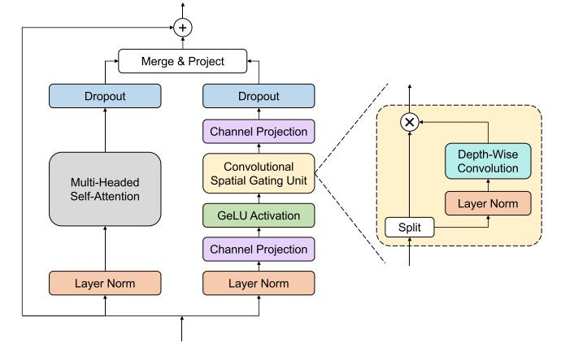

# Branchformer: Parallel MLP-Attention Architectures to Capture Local and Global Context for Speech Recognition and Understanding

论文地址：

- [https://arxiv.org/abs/2207.02971](https://arxiv.org/abs/2207.02971)

## 整体思路以及计算方式

利用并联的方式结合Attention和FFN：

## 时间复杂度

$O(n^2d)$。

## 训练以及loss

不考虑。

## 代码

- [https://github.com/espnet/espnet](https://github.com/espnet/espnet)

## 实验以及适用场景

ASR的实验，这里不讨论。

## 细节

暂无。

## 简评

思路可以借鉴，可以在其他任务中进行测试。