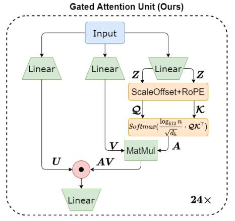

# Supplementary Material: Implementation and Experiments for GAU-based Model

论文地址：

- [https://arxiv.org/abs/2205.05842](https://arxiv.org/abs/2205.05842)

## 整体思路以及计算方式

一篇对苏神提出方法的总结，利用2层GAU代替Transformer：

计算方式如下：

- 给定输入$X\in \mathbb R^{n\times d}$
- 线性变换：$Z=XW_Z\in \mathbb R^{n\times d}, U=X W_U \in \mathbb R^{n\times d}, V=XW_V \in \mathbb R^{n\times d_2}$
- 计算$Q , K$：$Q= Z + b_Q + RoPE\in \mathbb R^{n\times d_2}, K = Z+ b_K + RoPE\in \mathbb R^{n\times d_2}$
- Attention Matrix：$A=\mathrm{SoftMax}\left(\frac{\log_{512}n}{\sqrt{d_2}} Q K^T\right)\in \mathbb R^{n\times n}$
- 输出：$O=U\odot (A V) \in \mathbb R^{n\times d}$

## 时间复杂度

依然是$O(n^2)$，但是实际中比Transformer快。

## 训练以及loss

不变。

## 代码

暂无。

## 实验以及适用场景

适用于所有场景，论文测了CLUE benchmark，效果还不错。

## 细节

暂无，基本包含全部细节。

## 简评

算是一个不错的方法， 把苏神提出的方法实现并改进，值得复现。