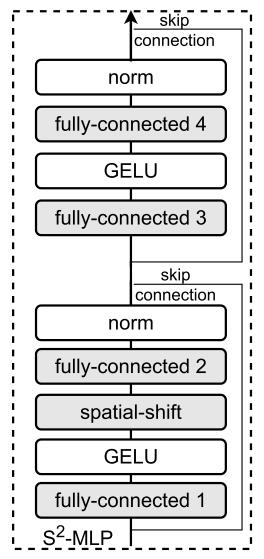

# S2-MLP: Spatial-Shift MLP Architecture for Vision

论文地址：

- [https://arxiv.org/abs/2106.07477](https://arxiv.org/abs/2106.07477)

## 整体思路以及计算方式

利用MLP解决CV问题，思路很简单，整体如下：

比较重要的是spatial-shift操作，主要思路是将每个patch和周围的信息进行交互，因为纯MLP只有特征交互，没有Patch交互，这个操作还是挺巧妙的。

## 时间复杂度

时间复杂度为$$O(ndk)$$，其中$$k$$为常数。

## 训练以及loss

不变。

## 代码

- [https://github.com/liuruiyang98/Jittor-MLP/blob/main/models_pytorch/s2_mlp_v1.py](https://github.com/liuruiyang98/Jittor-MLP/blob/main/models_pytorch/s2_mlp_v1.py)

## 实验以及适用场景

跑了CV任务，效果在MLP结构中还行。

## 细节

暂无。

## 简评

spatial-shift操作很巧妙，可以尝试在NLP中使用。