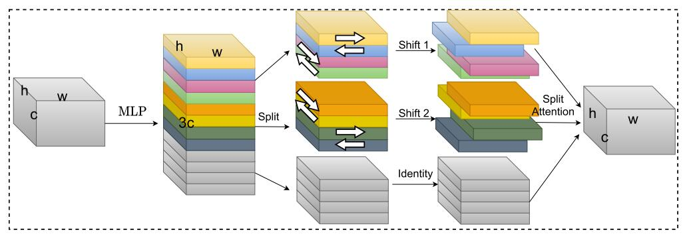

# S2-MLPv2: Improved Spatial-Shift MLP Architecture for Vision

论文地址：

- [https://arxiv.org/abs/2108.01072](https://arxiv.org/abs/2108.01072)

## 整体思路以及计算方式

对S2-MLP的改进，使用了多种spatial-shift，然后split attention进行特征融合：

这里主要介绍split attention的计算方式：

- 输入：$\left[{X}_{1}, {X}_{2}, \cdots, {X}_{K}\right]\in \mathbb R^{n\times K\times c} , X_k\in \mathbb R^{n\times c}$
- 特征融合：$a= \sum_{k=1}^K 1_n X_k \in \mathbb R^c$
- $a_1 = \sigma(a W_1) \in \mathbb R^{c_1}$
- $a_2 = a_1 W_2 \in \mathbb R^{K c}$
- $a_3 =\mathrm{Softmax}(\mathrm{reshape}(a_2),\mathrm{dim}=1)\in \mathbb R^{1\times K\times  c}$
- $o_1=\left[{X}_{1}, {X}_{2}, \cdots, {X}_{K}\right]\odot a_3 \in \mathbb R^{n\times K \times c }$ 
- $o_2 = \mathrm{sum}(o_1, \mathrm{dim}=1)\in \mathbb R^{n\times c}$

该模块主要融合了$X_k$的特征，不知道是否可以代替Attention的效果？

## 时间复杂度

split attention模块的时间复杂度为$O(nKc + cc_1 + Kc_1c )$，其余部分任然为线性复杂度。

## 训练以及loss

不变。

## 代码

- [https://github.com/liuruiyang98/Jittor-MLP/blob/main/models_pytorch/s2_mlp_v2.py](https://github.com/liuruiyang98/Jittor-MLP/blob/main/models_pytorch/s2_mlp_v2.py)

## 简评

spatial-shift + split attention可以大幅提升性能，可以研究下，然后在nlp中使用。