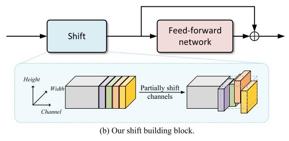

# When Shift Operation Meets Vision Transformer: An Extremely Simple Alternative to Attention Mechanism

论文地址：

- [https://arxiv.org/abs/2201.10801](https://arxiv.org/abs/2201.10801)

## 整体思路以及计算方式

用Shift操作代替Attention，达到Token mixer的效果，不过看了代码，发现模型的FFN换成了卷积，所以比较也是不太公平的，但是整体思路可以借鉴：

## 时间复杂度

不太好计算，理论上是$$O(nd)$$，但是实际会慢一点。

## 训练以及loss

不变。

## 代码

- [https://github.com/microsoft/SPACH](https://github.com/microsoft/SPACH)

## 实验以及适用场景

适用于Encoder。

## 细节

和S2-MLP思路非常像。

## 简评

很简洁的一个思路。