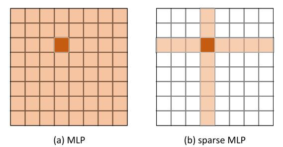

# Sparse MLP for Image Recognition: Is Self-Attention Really Necessary?

论文地址：

- [https://arxiv.org/abs/2109.05422](https://arxiv.org/abs/2109.05422)

## 整体思路以及计算方式

利用Sparse MLP进行Token Mixing：

实现起来也非常简单，见论文伪代码。

## 时间复杂度

$$O(nd^2)$$。

## 训练以及loss

## 代码

- [https://github.com/microsoft/SPACH](https://github.com/microsoft/SPACH)

## 实验以及适用场景

只适用于CV场景。

## 细节

暂无。

## 简评

很简单的思路，也比较优雅。