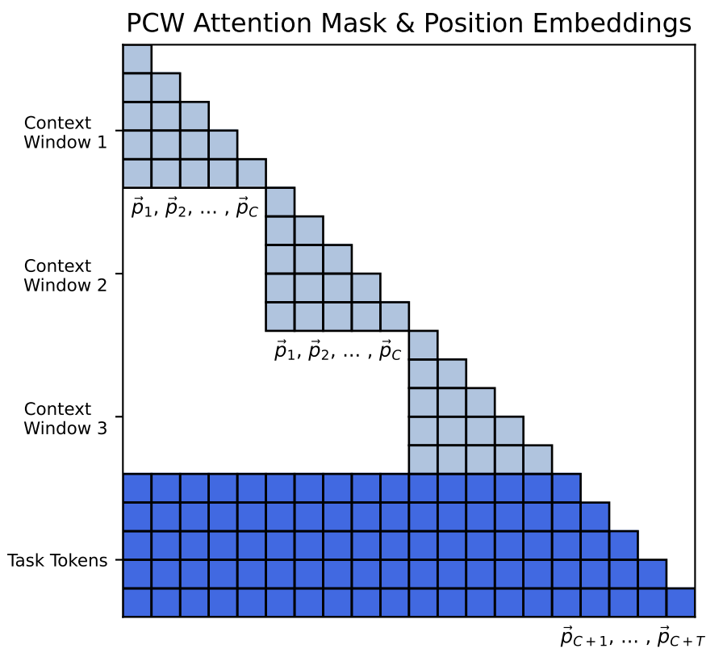

# Parallel Context Windows for Large Language Models

论文地址：

- [https://arxiv.org/pdf/2212.10947.pdf](https://arxiv.org/pdf/2212.10947.pdf)

## 整体思路以及计算方式

提供了一个让LM处理更长序列的思路，图示如下：

首先假设输入分为context window和task token。假设最大训练长度为$$N$$，task token的序列长度为$$T$$，那么context window的序列长度不能超过$$C=N-T$$，后续计算时，context window内部做self attention, task token和全部context window做cross attention（概念上，不准确的描述），和自身做self attention。另一方面context window中使用前$$C$$个位置编码，task token使用$$C+1\sim N$$个位置编码。

## 简评

还不错的思路，唯一的问题是task token计算attention时的序列长度长于$$N$$，可能有泛化性的问题。
