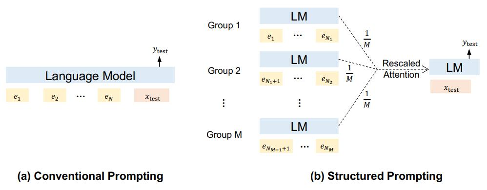

# Structured Prompting: Scaling In-Context Learning to 1,000 Examples

论文地址：

- [https://arxiv.org/pdf/2212.06713.pdf](https://arxiv.org/pdf/2212.06713.pdf)

## 整体思路以及计算方式

提供了一个让LM处理更长序列的思路，图示如下：

步骤一：

- 将输入拆成$$M$$组，组内位置编码右对齐，统一为$$p_{n}, p_{n-1},\ldots$$，输入的位置编码为$$p_{n+1}$$；
- 组内做attention，对输出结果取均值，最终得到$$M$$个向量$$\mathbf y_1, \ldots, \mathbf y_M$$；
- 将输入$$\mathbf x$$作为query，$$\mathbf x, \mathbf y_1, \ldots, \mathbf y_M$$作为key, value做attention得到最终结果；
  - 注意$$x$$和自身的attention weight加强了；

## 简评

还可以的思路，不过细节得看代码。