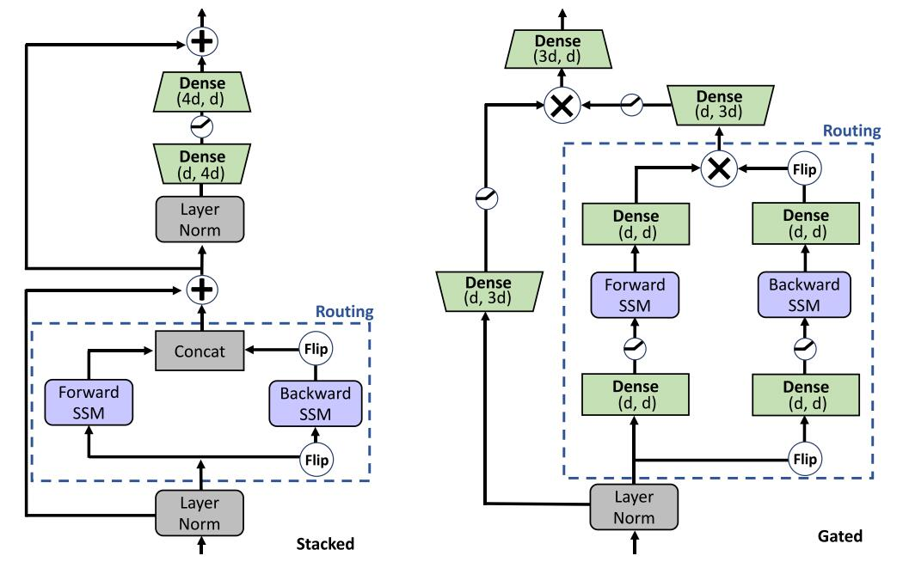

# Pretraining Without Attention

论文地址：

- [https://arxiv.org/abs/2212.10544](https://arxiv.org/abs/2212.10544)

## 整体思路以及计算方式

在双向LM上测试了S4，注意S4本身不支持双向，需要进行翻转才可以处理双向：

使用了24hBERT的设置，最后的结论是Gated版本和Transformer结果相当。作者简单分析了一下Stacked和Gated的区别，感觉信息量不大，最后的结论是Gated版本效果更好。

