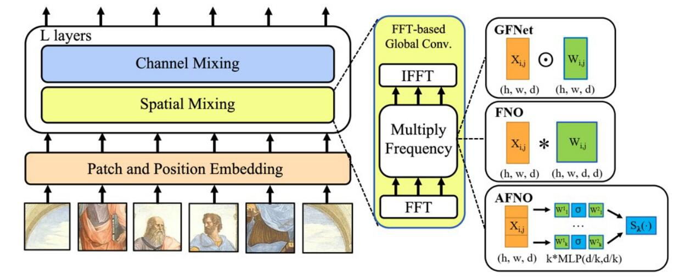

# Adaptive Fourier Neural Operators: Efficient Token Mixers for Transformers

论文地址：

- [https://arxiv.org/abs/2111.13587](https://arxiv.org/abs/2111.13587)

参考资料：

- [https://www.cvmart.net/community/detail/6177](https://www.cvmart.net/community/detail/6177)

## 整体思路以及计算方式

对于2维输入$$\mathbf X\in \mathbb R^{n\times d}$$：
$$
\mathbf Y =\mathrm{reshape}(\mathcal F(\mathbf X), n,-1, d/k) \in \mathbb R^{n\times k\times (d / k)}
$$
分块矩阵乘法：：
$$
\begin{aligned}
\mathbf Y_1 &= f(\mathbf Y  \mathbf W_1) \in \mathbb R^{n\times k \times (d/k)},\mathbf W_1 \in \mathbb R^{k\times (d/k)\times (d/k)}\\
\mathbf Y_2 &= \mathbf Y_1 \mathbf W_2 \in \mathbb R^{n\times k \times (d/k)}, \mathbf W_2 \in \mathbb R^{(d/k)\times (d/k)}

\end{aligned}
$$
输出：
$$
\mathbf O=\mathcal F^{-1}(\mathrm{reshape}(\mathrm{softshrink} (\mathbf Y_2), n , d) ) \in \mathbb R^{n\times d}
$$
FNO系列的对比图：

## 时间复杂度

$$O(nd\log n+ n d^2 /k)$$

## 训练以及loss

不变。

## 代码

- [https://github.com/NVlabs/AFNO-transformer](https://github.com/NVlabs/AFNO-transformer)

## 实验以及适用场景

适用于Encoder，效果还不错。

## 细节

softshrink操作的是因为在频域中，能量大多数集中在高频。

## 简评

这篇论文的写作是非常好的，理清楚了FNO系列的动机，改进；方法本身也值得复现。