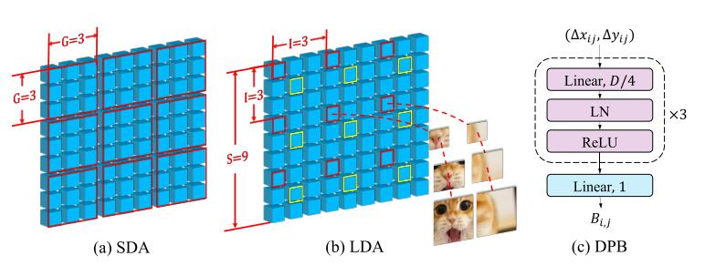

## CrossFormer: A Versatile Vision Transformer Hinging on Cross-scale Attention

论文地址：

- [https://openreview.net/forum?id=_PHymLIxuI](https://openreview.net/forum?id=_PHymLIxuI)

## 整体思路以及计算方式

利用LocalGlobal的思想降低Attention计算量，并且增加了动态相对位置编码，整体结构如下：

## 时间复杂度

$O(ndc)$，其中$c$为常数。

## 训练以及loss

不变。

## 代码

- [https://github.com/cheerss/CrossFormer](https://github.com/cheerss/CrossFormer)

## 实验以及适用场景

论文测试了Encoder常见，在Decoder场景中如何使用需要研究一下。

## 细节

实现的挺巧妙的，利用Reshape即可，具体可以参考代码部分。

## 简评

该工作简洁，有效，非常赏心悦目，值得复现。