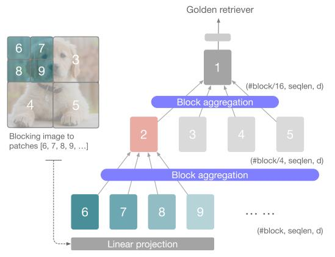

# Nested Hierarchical Transformer: Towards Accurate, Data-Efficient and Interpretable Visual Understanding

论文地址：

- [https://arxiv.org/abs/2105.12723](https://arxiv.org/abs/2105.12723)

## 整体思路以及计算方式

利用分组和分阶段的思想计算Attention：

- 在每个阶段：
  - 在每个组内计算Attention；
  - 对组内Token做卷积，降低维度；
- 输出结果；

整体结构如下：

## 时间复杂度

$$O(n^2d)$$，但是$$n$$会随着阶段变小。

## 训练以及loss

不变。

## 代码

- [https://github.com/google-research/nested-transformer](https://github.com/google-research/nested-transformer)
- [https://github.com/lucidrains/vit-pytorch/blob/main/vit_pytorch/nest.py](https://github.com/lucidrains/vit-pytorch/blob/main/vit_pytorch/nest.py)

## 实验以及适用场景

测试了CV场景，效果不错。

## 细节

暂无。

## 简评

本质上和window attention类似，是一种local的方法。