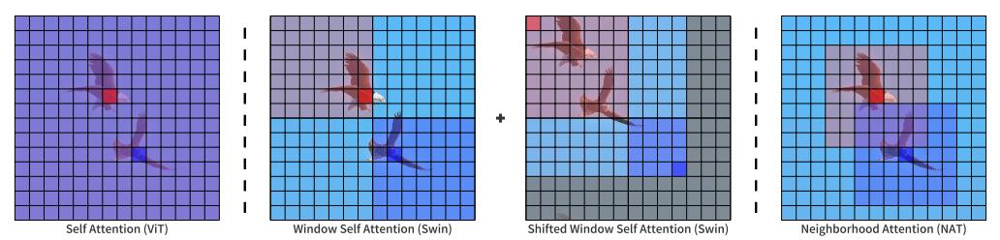

# Neighborhood Attention Transformer

论文地址：

- [https://arxiv.org/abs/2204.07143](https://arxiv.org/abs/2204.07143)

## 整体思路以及计算方式

依然是利用Window(Local) Attention的思路，区别在于Window的中心为Query：

## 时间复杂度

$O(l^2 d)$，其中$l$为窗口内token的数量。

## 训练以及loss

不变。

## 代码

- [https://github.com/SHI-Labs/Neighborhood-Attention-Transformer](https://github.com/SHI-Labs/Neighborhood-Attention-Transformer)

## 实验以及适用场景

适用于所有CV场景，也可以尝试在nlp中。

## 细节

暂无。

## 简评

思路非常简单，难点在于工程实现。