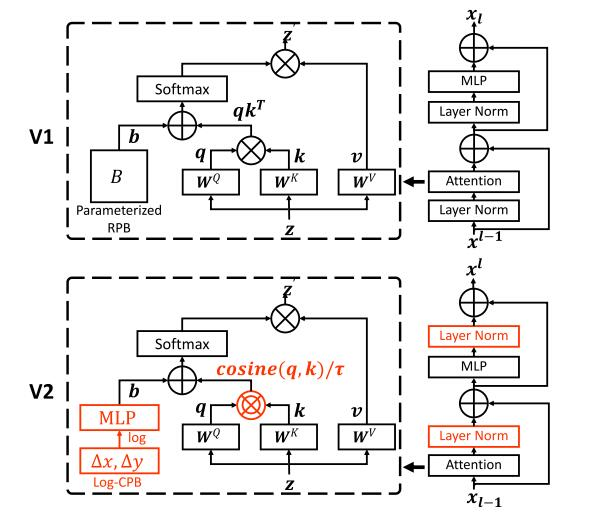

# Swin Transformer V2: Scaling Up Capacity and Resolution

论文地址：

- [https://arxiv.org/abs/2111.09883](https://arxiv.org/abs/2111.09883)

## 整体思路以及计算方式

对Swin-Transformer做了一些工程上的改进：

1. PreNorm换成PostNorm；
2. $$\mathbf q, \mathbf k$$做内积之前先过了归一化：$$\mathbf q= \mathbf q/\|\mathbf q \|_2, \mathbf k= \mathbf k/\|\mathbf k \|_2$$；
3. 增加相对位置编码：$$f(\log (i-j))$$；

图示：

## 时间复杂度

不考虑。

## 训练以及loss

不考虑。

## 代码

- [https://github.com/microsoft/Swin-Transformer](https://github.com/microsoft/Swin-Transformer)

## 细节

细节挺多的，复现的时候细读。

## 简评

做了一些工程上的改进，代码库中也有cuda相关代码，值得复现。