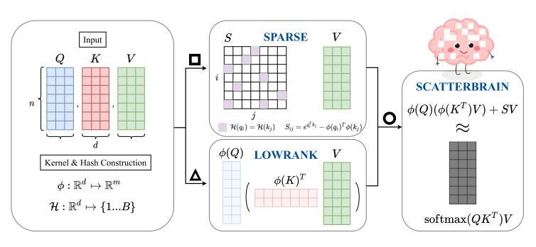

# Scatterbrain: Unifying Sparse and Low-rank Attention Approximation

论文地址：

- [https://arxiv.org/abs/2110.15343](https://arxiv.org/abs/2110.15343)

## 整体思路以及计算方式

将Sparse Attention和Kernel Attention并联：

## 时间复杂度

$O(nd^2)$。

## 训练以及loss

不变。

## 代码

- [https://github.com/HazyResearch/fly](https://github.com/HazyResearch/fly)

## 实验以及适用场景

略过。

## 细节

暂无。

## 简评

思路很简洁，但是新意也比较有限，代码部分可以学习一下。