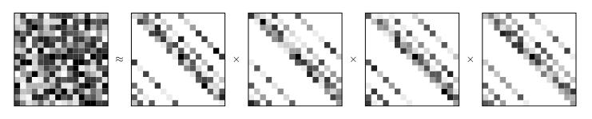

# Sparse Factorization of Large Square Matrices

论文地址：

- [https://arxiv.org/abs/2109.08184](https://arxiv.org/abs/2109.08184)

## 整体思路以及计算方式

利用多个稀疏矩阵近似方阵：
$$
\underset{\mathbf W^{(1)}, \ldots, \mathbf W^{(M)}}{\operatorname{minimize}}\left\|\mathbf X-\prod_{m=1}^{M}\mathbf W^{(m)}\right\|_{F}^{2}
$$
每个稀疏矩阵的pattern由Chord protocol协议人为指定。

图示：

## 时间复杂度

不太好计算，涉及稀疏矩阵乘法。

## 训练以及loss

不变。

## 代码

- [https://github.com/RuslanKhalitov/SparseFactorization](https://github.com/RuslanKhalitov/SparseFactorization)

## 实验以及适用场景

方法是普适的，实验比较简单，效果尚可。

## 细节

暂无。

## 简评

指定稀疏形式的动机不明确，LRA代码部分值得参考。