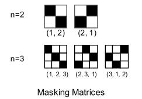

# Blockwise Self-Attention for Long Document Understanding

论文地址：

- [https://arxiv.org/abs/1911.02972](https://arxiv.org/abs/1911.02972)

## 整体思路以及计算方式

置换加分块的方式计算Attention：

## 时间复杂度

假设块的大小为$$m$$，总时间复杂度为$$O(nmd)$$。

## 训练以及loss

不变。

## 代码

暂无。

## 实验以及适用场景

因为涉及到置换，所以只适用于Decoder。

## 细节

暂无。

## 简评

简单有效的想法。