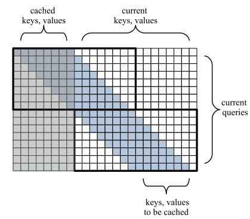

# Block-Recurrent Transformers

论文地址：

- [https://arxiv.org/abs/2203.07852](https://arxiv.org/abs/2203.07852)

## 整体思路以及计算方式

利用Memory的方式增加Transformer的性能，利用窗口的方式降低计算复杂度，对Memory部分使用递归的方式更新。

计算方式：

- 输入：$$\mathbf X\in \mathbb R^{n\times d}, \mathbf M \in \mathbb R^{m\times d}$$；
  - $$\mathbf M$$表示Memory；
- 输出部分更新方式：
  - $$\mathbf X_1=\mathrm{MHA}_{w}(\mathbf X, \mathbf X)\in \mathbb R^{n\times d}$$
  - $$\mathbf Y_1=\mathrm{MHA}_{w}(\mathbf X, \mathbf M)\in \mathbb R^{n\times d}$$
  - $$\mathbf O =[\mathbf X_1, \mathbf Y_1] \mathbf W \in \mathbb R^{n\times d}$$
- Memory部分更新方式：
  - $$\mathbf M_1=\mathrm{MHA}_{w}(\mathbf M,  \mathbf M)\in \mathbb R^{m\times d}$$
  - $$\mathbf Y_1=\mathrm{MHA}_{w}(\mathbf M, \mathbf X)\in \mathbb R^{m\times d}$$
  - $$\mathbf O =[\mathbf M_1, \mathbf Y_1] \mathbf W \in \mathbb R^{m\times d}$$

备注，这里省略了ffn部分，其中$$\mathbf M$$的ffn为rnn。

整体结构：

## 时间复杂度

$$O((n+m)wd)$$。

## 训练以及loss

不变。

## 代码

- [https://github.com/dashstander/block-recurrent-transformer](https://github.com/dashstander/block-recurrent-transformer)

## 实验以及适用场景

论文测试了lm，效果还不错。

## 细节

暂无。

## 简评

依然是一个空间换性能的方法。