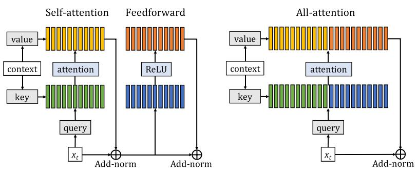

# Augmenting Self-attention with Persistent Memory

论文地址：

- [https://arxiv.org/abs/1907.01470](https://arxiv.org/abs/1907.01470)

## 整体思路以及计算方式

思路非常简单，给Transformer模块增加和输入无关的记忆模块，并且删除FFN：

计算流程：

- 输入：$$\mathbf Q,\mathbf K, \mathbf V\in \mathbb R^{n\times d}$$；
- 内部参数：$$\mathbf M_k, \mathbf M_{v} \in \mathbb R^{N\times d}$$；
  - $$N$$为预设的最大值；
- $$\mathbf K_1 = [\mathbf K, \mathbf M_{k}[:n]]\in \mathbf R^{(n+N)\times d}$$
- $$\mathbf V_1 = [\mathbf V, \mathbf M_{v}[:n]]\in \mathbf R^{(n+N)\times d}$$
- 输出：$$\mathrm{MHA}(\mathbf Q, \mathbf K_1, \mathbf V_1)\in \mathbb R^{n\times d}$$

## 时间复杂度

$$O(n(n+N)d)$$。

## 训练以及loss

不变。

## 代码

暂无，但是实现起来不难。

## 实验以及适用场景

论文测试了lm，有一定的性能提升。

## 细节

暂无。

## 简评

不错的想法，有助于大家理解FFN的作用，后续可以考虑复现。