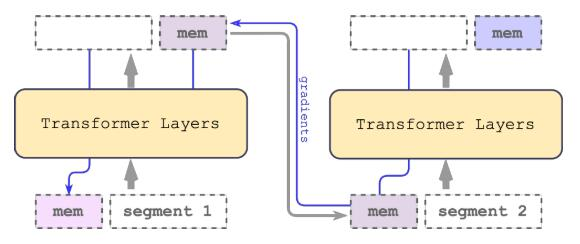

# Recurrent Memory Transformer

论文地址：

- [https://arxiv.org/abs/2207.06881](https://arxiv.org/abs/2207.06881)

## 整体思路以及计算方式

对Transformer-XL做了改进，增加了读写内存（可微），整体流程如下：

- 输入：$$\mathbf X\in \mathbb R^{n\times d}$$；	
  - 分块成为$$\mathbf X = [\mathbf X_0, \ldots, \mathbf X_{k-1}], \mathbf X_i\in \mathbb R^{m\times d}, km=n$$；

- 记忆Token：$$\mathbf M\in \mathbb R^{l\times d}$$；
- 对于第$$i$$层Transformer Layer:
  - 初始化$$\mathbf M^i_0 = \mathbf M^{i}\in \mathbb R^{l\times d}$$；
  - 对于$$j=0,\ldots, k-1$$：
    - 拼接：$$\mathbf Y_i= [\mathbf M^i_j , \mathbf X_j, \mathbf M^i_j]\in \mathbb R^{(m+2l)\times d}$$；
    - $$\mathbf O_i =\mathrm{Tran}(\mathbf Y_i, \mathbf Y_i)\in \mathbb R^{(m+2l)\times d}$$；
    - 更新：$$\mathbf M^i_{j+1}= \mathbf O_i [-m:,:]\in \mathbb R^{l\times d}$$；

  - 下一层的记忆Token为：$$\mathbf M^{i+1}= \mathbf M^i_{k}\in \mathbb R^{l\times d}$$；

图示：

## 时间复杂度

$$O((m+2l)^2\times k d)=O(nk d)$$，所以序列关于序列长度是线性的。

## 训练以及loss

不变。

## 代码

- [https://github.com/booydar/transformer-xl](https://github.com/booydar/transformer-xl)

## 实验以及适用场景

适用于Encoder和Decoder。

## 细节

暂无。

## 简评

整体思路是首先用window attention计算，但是跨window之间没有信息交互，global memory的动机就是弥补这点：在第$$i$$个window中，global memory有前$$i-1$$个window的信息，所以当前window的token和global memory的交互可以一定程度上代表和前$$i-1$$个window中全部的token进行交互，从而完成跨window的交互，所以本质上还是local-global的思路。