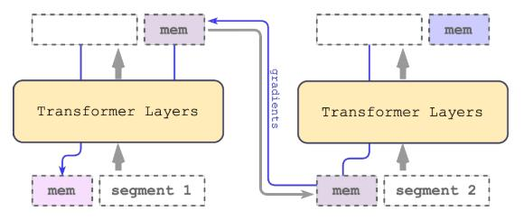

# Adapting Language Models to Compress Contexts

论文地址：

- [https://arxiv.org/pdf/2305.14788.pdf](https://arxiv.org/pdf/2305.14788.pdf)

## 整体思路以及计算方式

和Recurrent Memory Transformer非常类似，首先回顾Recurrent Memory Transformer的形式：

接着看这篇文章的形式：

memory到summary token只是换了名字，真正的区别在于本文将每一段的summary token都作为当前段的前缀输入。

## 代码

- [https://github.com/princeton-nlp/AutoCompressors](https://github.com/princeton-nlp/AutoCompressors)

## 简评

相当于增加了short cut，这应该是带来提升的原因。