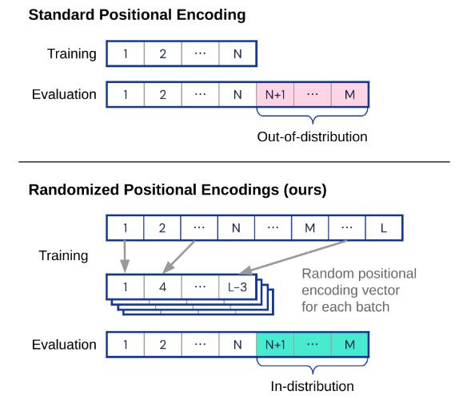

# Randomized Positional Encodings Boost Length Generalization of Transformers

论文地址：

- [https://arxiv.org/pdf/2305.16843.pdf](https://arxiv.org/pdf/2305.16843.pdf)

## 整体思路以及计算方式

本文是解决外推性的一个方法，思路很简单。lm无法外推到更长的序列是因为有一些位置编码没见过，所以第一步是将位置编码扩容，从$$\{1,\ldots, N\}$$扩容到$$\{1,\ldots, L\}$$，其中$$L\gg N$$，$$N$$为训练的最大序列长度。但是扩容后还有一个问题，如果按照正常训练，位置编码最多使用到$$N$$，要使得更远的位置得到训练，就需要作者提出的Randomized Positional Encoding，其思路为从$$\{1,\ldots, L\}$$不放回采样$$N$$个样本，用这些样本代替$$\{1,\ldots, N\}$$。在inerence时需要稍作修改，假设序列长度为$$M$$，那么采样的集合为$$\{1,\ldots, M\}$$。整体图示如下：

## 代码

- [https://github.com/deepmind/randomized_positional_encodings](https://github.com/deepmind/randomized_positional_encodings)

## 简评

不错的思路，可以适当参考。