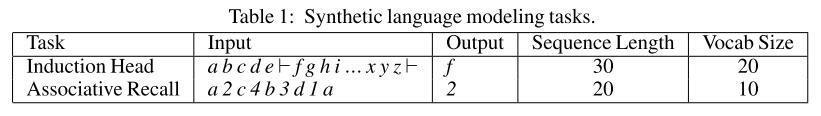
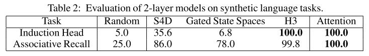
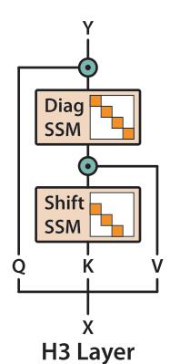

# Hungry Hungry Hippos: Towards Language Modeling with State Space Models

论文地址：

- [https://arxiv.org/abs/2209.11895](https://arxiv.org/abs/2209.11895)

## 整体思路以及计算方式

贡献分为两点：

- 解决SSM遗忘的问题；
- 提供一个高效的cuda kernel；

这里主要讲第一点，第二点直接拿来用就行。

作者首先引入两个问题：

Induction Head的问题是，记住某个特殊符号后一个字符是什么，例如上图中的特殊字符是$$\vdash$$，那么输出就是$$f$$。

Associative Recall的问题是，记录key对应的value，这里的输入是kev, value pair，例如a对应的输出就是2。

首先作者从如下实验指出SSM有遗忘的问题：

作者解决方案如下：

即使用$$\mathbf{Q, K, V}$$的概念，然后$$\mathbf{K}$$过两个SSM，其中第一个SSM的$$\mathbf A$$矩阵为位移矩阵，第二个SSM的$$\mathbf A$$矩阵为对角阵，作者声称这样能记住信息，我个人对这个说法不太买账。

计算公式为：
$$
\mathbf{Q} \odot \mathrm{SSM}_{\text {diag }}\left(\mathrm{SSM}_{\text {shift }}(\mathbf{K}) \odot \mathbf{V}\right)
$$

## 代码

- [https://github.com/HazyResearch/H3](https://github.com/HazyResearch/H3)

## 简评

对作者的解释不是很满意，感觉这里真正起作用的原因应该是double gating使得系数和输入有关。这里做有用的部分应该是那个cuda kernel。